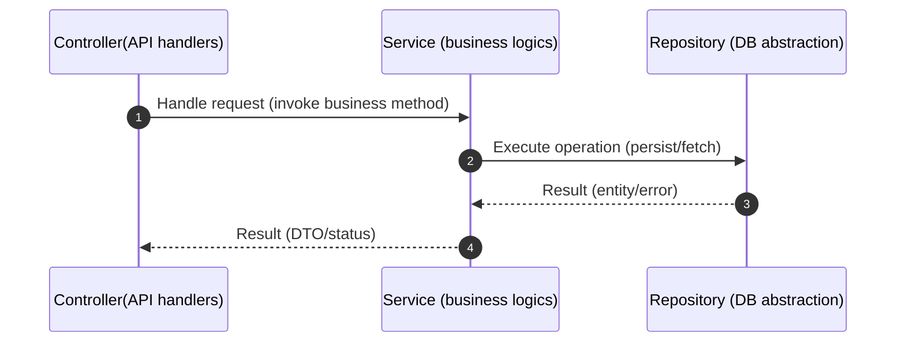

# Go Service Boilerplate

<p align="center">
  
  
  
  
</p>


Clean, testable Go service built with Echo for HTTP and GORM for persistence, following a strict layered design (Controller → Service → Repository) with interfaces at boundaries and dependency injection at the composition root. It includes custom request validation, structured logging, configuration via Viper, optional Swagger documentation, and database migrations. Local development uses Docker Compose for Postgres, and tests run against a managed test database (also exercised in CI). The example domain is a simple User CRUD to keep the focus on structure.

## Why This Boilerplate Wins


- Strict ideomatic layered architecture with interfaces and DI for testability.
- Ready CI pipeline with gotestsum and GitHub Actions.
- Developer-friendly Makefile: start, migrate, serve, test, docs.
- Built-in validation with custom tags and consistent error mapping.

- Docker Compose local stack with Postgres and migrations.
- Ready API docs hosting setup with Swagger UI.


## Layered Architecture (Go Practices)

- Clear separation of concerns:
  - Controller: HTTP I/O, request validation, response shaping.
  - Service: Business rules; orchestrates repository calls.
  - Repository: Persistence access; abstracts GORM specifics.
  - Model: Domain types and cross-layer validators.
- Explicit interfaces at boundaries enable mocking, isolation, and inversion.
- Narrow handlers and DTOs:
  - Controllers bind to specific request types (e.g., `UserCreateRequest`) and validate via Echo’s validator with custom tags.
- Error translation:
  - Internal errors mapped to HTTP responses with typed codes (`internal/errors/codes.go`).

Dependency flow:
- `Repository → Service → Controller` (strict upward direction)
- `Server` composes dependencies and registers routes; layers never reach “down” across.

For a comprehensive explanation of architecture and patterns, see `docs/architecture.md`.

## Project Structure

```
.
├── cmd/                      # CLI entrypoints
│   ├── server.go             # Starts API and optional Swagger server
│   ├── migrate.go            # (extensible) migrations CLI
│   └── root.go               # Config loading and CLI wiring
├── internal/
│   ├── controller/           # HTTP handlers, validation, routes
│   │   ├── user.go           # User CRUD handlers
│   │   ├── health.go         # Health endpoint
│   │   ├── validator.go      # Echo validator with custom rules
│   │   ├── routes.go         # Route registration
│   │   └── *_test.go         # Controller tests (integration-style)
│   ├── service/              # Business logic
│   │   └── user.go           # UserService interface + implementation
│   ├── repository/           # Data access abstractions
│   │   └── user.go           # UserRepository interface + GORM impl
│   ├── model/                # Domain and config types
│   │   └── user.go           # User model + validators
│   ├── server/               # API server composition (DI), middleware
│   │   ├── api.go            # Build Echo engine, DI wiring, route groups
│   │   ├── api_server.go     # Server lifecycle (run/shutdown)
│   │   ├── swagger_server.go # Optional Swagger server
│   │   └── *_test.go         # Server tests
│   ├── db/                   # DB connection and migrations
│   │   ├── db.go             # Connect, test DB auto-create, migrate
│   │   └── migration.go      # Apply DDL/DML migrations
│   └── utils/                # Cross-cutting utilities (logging)
├── migrations/               # SQL migrations (DDL/DML)
├── config.yaml               # App config (DB, servers)
├── config.test.yaml          # Test config (uses `user_test` DB)
├── main.go                   # Binary entrypoint (CLI)
└── README.md                 # You are here
```


## Sequence Diagram

Simple request/response flow across core layers:




## Running Locally

1. Install Go 1.25+.
2. Prerequisites:
   - Docker & Docker Compose (for local dependencies)
   - Optional dev tools: `golangci-lint`, `swag`, `npx @redocly/cli`
3. Start local dependencies (Postgres via Docker Compose):
   - `make start`
4. Apply database migrations:
   - `make migrate`
5. Access the APIs:
   - Access backend health: `http://localhost:8082/api/v1/health`
   - Access Swagger UI for more details: `http://localhost:1314/swagger/index.html`
6. Stop or clear containers:
   - `make stop` or `make clear`
7. Configuration: see `config.yaml` (runtime) and `config.test.yaml` (tests).

## Migrations

- Auto-migration: GORM migrates models on startup and in tests.
- Apply SQL migrations:
  - Default environment: `make migrate`
  - Test environment: `make migrate-test`
- Reset databases:
  - Default DB: `make reset-db`
  - Test DB: `make reset-test-db`
- Extend by adding new SQL files and models; keep schema changes additive and versioned.

## Used Practice and Patterns

This section summarizes the core engineering practices and design patterns used across the service.

### Repository Pattern

- Abstracts persistence behind an interface with a GORM-backed implementation.
- Isolates ORM specifics from business logic and simplifies testing.
- Enables dependency inversion by having services depend on repository interfaces.

### Dependency Injection & Inversion

- Dependencies are composed in the server layer, wiring concrete implementations behind interfaces.
- Dependency Inversion: services depend on `UserRepository` (interface) rather than GORM directly.
- Dependency Injection: concrete repository is injected into the service; service into the controller.
- Result: testable, replaceable units with minimal coupling.


### Testing & CI (TDD-friendly)

- Test scopes:
  - Controller tests (`internal/controller/*_test.go`) exercise request binding/validation and handler behavior against a real DB.
  - Server tests verify route registration and middleware wiring.
- Test DB provisioning:
  - `internal/db.NewTestDB()` connects to the default `postgres` DB, auto-creates `user_test` if missing, then runs migrations.
- CI:
  - GitHub Actions workflow (`.github/workflows/test.yml`) runs `go test ./...` on PRs/commits, catching regressions early.


### Validation & Integrated API Documentation (Swagger)

- Validation: Echo validator with custom tags registered in `internal/controller/validator.go`.
- Swagger:
  - Swagger Server can be enabled via config; docs import is intentionally omitted until generated.
  - Base setup for Swagger UI hosting is included out of the box.
  - Access the hosted Swagger UI at `http://localhost:1314/swagger/index.html`.
  - Use `make swagger` to regenerate the spec and HTML when endpoints change.

### Logging

- Structured request logging via Echo middleware (`internal/server/log.go`).
- Global logger initialization in `internal/utils/logger.go`.

## Contributing

Contribute by forking the repository, creating a topic branch (e.g., `feature/<short-name>` or `fix/<short-name>`), running tests (`make test` or `make test-ci`), linting/formatting (`make fmt` or `make lint`), generating docs if needed (`make swagger`), and opening a small, focused PR with a clear title and context. CI runs automatically on pull requests—please address any failures and reviewdog lint comments—and update documentation (README and `docs/architecture.md`) when behavior or architecture changes.