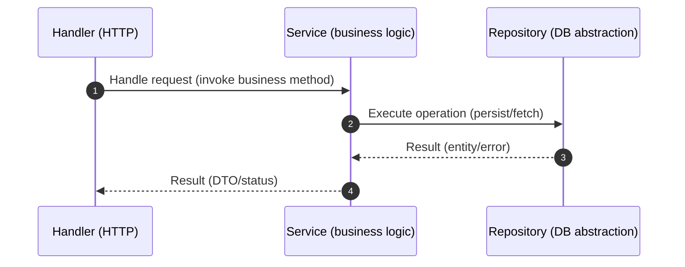

<h1 align="center">Go Service Boilerplate</h1>

<p align="center">
  
  
  
  
  
</p>

A production-ready Go service template built on **package-by-domain** architecture — each business domain owns its model, repository, service, and handler as a self-contained unit. Ships with Echo for HTTP, GORM for persistence, Google Wire for compile-time dependency injection, and a cross-domain port convention that keeps boundaries clean as the codebase grows. Two reference domains (`user`, `cases`) demonstrate the full pattern end-to-end, including a live cross-domain read through a typed port interface.

## Why This Boilerplate Wins

- 🗂️ Package-by-domain layout: each domain is a self-contained vertical slice, not spread across five folders.
- 🔌 Google Wire compile-time DI: missing providers are build errors, not nil panics at runtime.
- 🔗 Typed cross-domain ports: domain A reads from domain B through an interface it owns — no import cycles, no tight coupling.
- 🤖 Ready CI pipeline with gotestsum and GitHub Actions.
- 🛠️ Developer-friendly Makefile: start, migrate, wire, serve, test, docs.
- ✅ Built-in validation with custom tags and consistent error mapping.
- 🐳 Docker Compose local stack with Postgres and migrations.
- 📘 Ready API docs hosting setup with Swagger UI.


## Architecture

### Philosophy

Most Go services start as flat, layer-by-layer structures (`controller/`, `service/`, `repository/`) that work fine for one or two domains but degrade as the feature count grows: every new domain adds to the same folders, services reach across into unrelated repositories, and changes in one layer ripple unpredictably into others.

This boilerplate organizes code **by domain, not by layer**. Each domain is a vertical slice — it owns all layers for its concern. The composition root wires everything together. The result:

- A change in the `billing` domain touches only `internal/billing/`.
- A new domain is a new folder, not edits spread across five.
- Import cycle enforcement (the Go compiler itself) prevents unintended cross-domain coupling.
- Extracting a domain into its own service later is a folder move, not an untangling exercise.

### Layers within each domain

```
Handler  →  Service  →  Repository  →  DB
   ↑             ↑             ↑
  echo       interface      interface
  binding    boundary       boundary
```

- **Handler**: HTTP I/O only — bind, validate, call service, return response.
- **Service**: Business rules. Holds a `Repository` interface and any cross-domain ports.
- **Repository**: Persistence access. Holds `*gorm.DB`. The service never sees GORM.
- **Model**: GORM struct. Doubles as the domain model.

### Cross-domain boundaries

When domain A needs data from domain B, A declares a **port interface** in its own package. Domain B's service satisfies it. The composition root binds them. Domain A never imports domain B's model or repository — no import cycle, no tight coupling, and the dependency can later be replaced by a remote call if the domain is split into its own service.

```go
// internal/cases/ports.go — declared by the CONSUMER
type UserReader interface {
    EmailByID(id int) (string, error)
}
```

```go
// internal/server/wire.go — bound at the composition root
wire.Bind(new(cases.UserReader), new(user.Service))
```

Dependency flow:
- `Repository → Service → Handler` (strict upward direction)
- `Server` composes dependencies and registers routes; layers never reach "down" across.

For a complete walkthrough of adding domains, declaring ports, and Wire DI internals, see [`docs/domain-guide.md`](docs/domain-guide.md).


## Project Structure

```
.
├── cmd/
│   ├── server.go             # Start API + optional Swagger server
│   ├── migrate.go            # Run SQL migrations
│   └── root.go               # CLI wiring, config loading (Cobra + Viper)
│
├── internal/
│   ├── <domain>/             # One folder per business domain
│   │   ├── model.go          # GORM struct + domain validators
│   │   ├── repository.go     # Repository interface + GORM implementation
│   │   ├── service.go        # Service interface + business logic
│   │   ├── handler.go        # Echo handlers
│   │   ├── routes.go         # RegisterRoutes(g *echo.Group, h Handler)
│   │   ├── wire.go           # var ProviderSet = wire.NewSet(...)
│   │   ├── errors.go         # Domain-specific typed error vars
│   │   ├── ports.go          # Cross-domain port interfaces (if needed)
│   │   └── *_test.go         # Integration tests
│   │
│   ├── server/               # Composition root — wires and serves all domains
│   │   ├── api.go            # Echo engine, middleware, route mounting
│   │   ├── wire.go           # Wire injector declaration (wireinject build tag)
│   │   └── wire_gen.go       # Wire-generated code — do not edit manually
│   │
│   ├── db/                   # DB connection, AutoMigrate, SQL migration runner
│   ├── config/               # Config struct (loaded by Viper at startup)
│   ├── errors/               # Shared typed error codes (AppError)
│   └── health/               # Health check endpoint
│
├── pkg/                      # Reusable, business-agnostic plumbing
│   ├── web/                  # Echo base handler, request binding + validation
│   ├── response/             # HTTP response helpers and envelope types
│   └── logger/               # Logrus initialization
│
├── migrations/
│   ├── ddl/                  # Schema migrations (ALTER, constraints, indexes)
│   └── dml/                  # Data migrations (seed rows, reference data)
│
├── docs/                     # Generated Swagger spec (via make swagger)
├── config.yaml               # Runtime configuration
├── config.test.yaml          # Test configuration (separate test DB)
└── docker-compose.yml        # Local Postgres
```


## Sequence Diagram

Simple request/response flow across core layers:


```mermaid
sequenceDiagram
  autonumber
  participant Handler as Handler (HTTP)
  participant Service as Service (business logic)
  participant Repository as Repository (DB abstraction)

  Handler->>Service: Handle request (invoke business method)
  Service->>Repository: Execute operation (persist/fetch)
  Repository-->>Service: Result (entity/error)
  Service-->>Handler: Result (DTO/status)
```


## Adding a New Domain

Each domain is a folder under `internal/` with `model.go`, `repository.go`, `service.go`, `handler.go`, `routes.go`, and `wire_providers.go`. If it reads from another domain, add `ports.go`. Registration is 5 lines across 3 files in `internal/server/`.

See **[`docs/domain-guide.md`](docs/domain-guide.md)** for the full file-by-file template, cross-domain port setup, and Wire DI reference including when to run `make wire`.


## Running Locally

1. Install Go 1.25+.
2. Prerequisites:
   - Docker & Docker Compose (for local dependencies)
   - Optional dev tools: `golangci-lint`, `swag`, `npx @redocly/cli`
3. Start local dependencies (Postgres via Docker Compose):
   - `make start`
4. Apply database migrations:
   - `make migrate`
5. Access the APIs:
   - Access backend health: `http://localhost:8082/api/v1/health`
   - Access Swagger UI: `http://localhost:1315/swagger/index.html`
6. Stop or clear containers:
   - `make stop` or `make clear`
7. Configuration: see `config.yaml` (runtime) and `config.test.yaml` (tests).

## Configuration

Config is loaded via [Viper](https://github.com/spf13/viper) on startup. The active config file is passed as a CLI flag:

```bash
go run main.go server --config config.yaml
```

**`config.yaml`** — runtime:
```yaml
apiServer:
  enable: true
  port: 8082

swaggerServer:
  enable: true
  port: 1315

postgreSQL:
  host: localhost
  port: 5432
  user: postgres
  password: postgres
  dbname: user
  sslmode: disable
```

**`config.test.yaml`** — test runs (separate DB, no Swagger):
```yaml
postgreSQL:
  dbname: user_test
```

To add a config section for a new subsystem, extend `internal/config/config.go` with a new struct field and a matching YAML key.

## Migrations

Two migration tracks run on startup:

| Track | Location | Purpose |
|---|---|---|
| Auto-migration | `db.AutoMigrate(...)` in `db.go` | Keeps schema in sync with GORM models |
| SQL migrations | `migrations/ddl/` and `migrations/dml/` | Versioned DDL changes and seed data |

SQL migrations are applied in filename order. Name files with a numeric prefix:

```
migrations/
  ddl/
    001_create_user_schema.sql
    002_create_cases_schema.sql
    003_create_billing_schema.sql   ← new domain
  dml/
    001_insert_reference_data.sql
```

Keep schema changes **additive** — avoid `DROP COLUMN` or destructive alterations in migrations already applied in production.

- Apply SQL migrations:
  - Default environment: `make migrate`
  - Test environment: `make migrate-test`
- Reset databases:
  - Default DB: `make reset-db`
  - Test DB: `make reset-test-db`

## Repository Pattern

Abstracts persistence behind an interface with a GORM-backed implementation. Isolates ORM specifics from business logic and simplifies testing. Enables dependency inversion: services depend on `Repository` (interface) rather than GORM directly.

## Dependency Injection & Wire

[Google Wire](https://github.com/google/wire) generates compile-time dependency wiring from provider declarations. No reflection, no runtime surprises — a missing or mismatched provider is a build error, not a nil panic.

Each domain declares its provider set in `wire_providers.go`:
```go
var ProviderSet = wire.NewSet(NewRepository, NewService, NewHandler)
```

The composition root (`internal/server/wire.go`) declares the injector and binds cross-domain interfaces:
```go
//go:build wireinject

func InitializeHandlers(db *gorm.DB) (*Handlers, error) {
    wire.Build(
        user.ProviderSet,
        cases.ProviderSet,
        wire.Bind(new(cases.UserReader), new(user.Service)),
        wire.Struct(new(Handlers), "*"),
    )
    return nil, nil
}
```

Wire reads the injector and generates `wire_gen.go`. The generated file is committed and used in normal builds. See [`docs/domain-guide.md`](docs/domain-guide.md) for when to run `make wire` and troubleshooting.

## Testing & CI

Tests are **integration-style** — they run against a real Postgres test database. No mocked repositories; the goal is to catch schema/query bugs that mocks can never surface.

- Domain tests (`internal/<domain>/*_test.go`) exercise request binding, handler behavior, and DB operations against a real DB.
- Server tests verify route registration and middleware wiring.
- `internal/db.NewTestDB()` connects to the default `postgres` DB, auto-creates `user_test` if missing, then runs migrations.
- GitHub Actions workflow (`.github/workflows/test.yml`) runs `make test-ci` on PRs/commits.

## Validation & Swagger

Validation uses [go-playground/validator](https://github.com/go-playground/validator) registered with Echo. The base validator lives in `pkg/web/validator.go`; each domain supplies its own custom tags via the `RegisterValidations` hook passed at server startup.

Swagger annotations live in handler files. Generate spec and HTML after any endpoint change with `make swagger`. The Swagger server is toggled via `config.yaml`; access at `http://localhost:1315/swagger/index.html`.

## Error Handling

All HTTP errors follow a consistent JSON envelope:

```json
{
  "errors": [
    {
      "code": "NOT_FOUND",
      "message": "case not found"
    }
  ]
}
```

Typed error codes declared in `internal/errors/codes.go`. GORM's `ErrRecordNotFound` maps to 404; all other repo errors map to 500. Internal error details (SQL messages, stack traces) are never forwarded to the client.

## Logging

Structured request logging via Echo middleware (`internal/server/log.go`). Global logger initialization in `pkg/logger/logger.go`.


## Makefile Reference

| Target | Description |
|---|---|
| `make start` | Start Docker Compose (Postgres) |
| `make stop` | Stop containers |
| `make clear` | Stop containers and delete volumes |
| `make serve` | Run the API server locally |
| `make migrate` | Apply SQL migrations to the default DB |
| `make migrate-test` | Apply SQL migrations to the test DB |
| `make reset-db` | Drop, recreate, and migrate the default DB |
| `make reset-test-db` | Drop, recreate, and migrate the test DB |
| `make test` | Reset test DB and run all tests |
| `make test-ci` | Reset test DB, run tests, emit coverage report |
| `make wire` | Regenerate `internal/server/wire_gen.go` |
| `make swagger` | Regenerate Swagger spec and HTML |
| `make lint` | Run golangci-lint |
| `make fmt` | Format code, tidy modules, fix lint violations |


## Tech Stack

| Concern | Library |
|---|---|
| HTTP | [Echo v4](https://echo.labstack.com) |
| ORM | [GORM](https://gorm.io) + `gorm.io/driver/postgres` |
| Dependency injection | [Google Wire](https://github.com/google/wire) |
| Validation | [go-playground/validator v10](https://github.com/go-playground/validator) |
| Config | [Viper](https://github.com/spf13/viper) |
| CLI | [Cobra](https://github.com/spf13/cobra) |
| Logging | [Logrus](https://github.com/sirupsen/logrus) |
| API docs | [swaggo/swag](https://github.com/swaggo/swag) + Redocly |
| Testing | [testify](https://github.com/stretchr/testify) + gotestsum |


## Contributing

Contribute by forking the repository, creating a topic branch (e.g., `feature/<short-name>` or `fix/<short-name>`), then:

1. Follow the domain template in [`docs/domain-guide.md`](docs/domain-guide.md) when adding a new domain.
2. Run `make wire` after any constructor signature change or new provider — see the guide for the full trigger list.
3. Run `make fmt` and `make lint` before committing.
4. Run `make test` — all tests must pass against a real DB.
5. Regenerate docs with `make swagger` if endpoints changed.
6. Open a small, focused PR with a clear title and context. CI runs automatically on pull requests — please address all failures and reviewdog lint comments.
7. Update this README when structure or patterns change.
